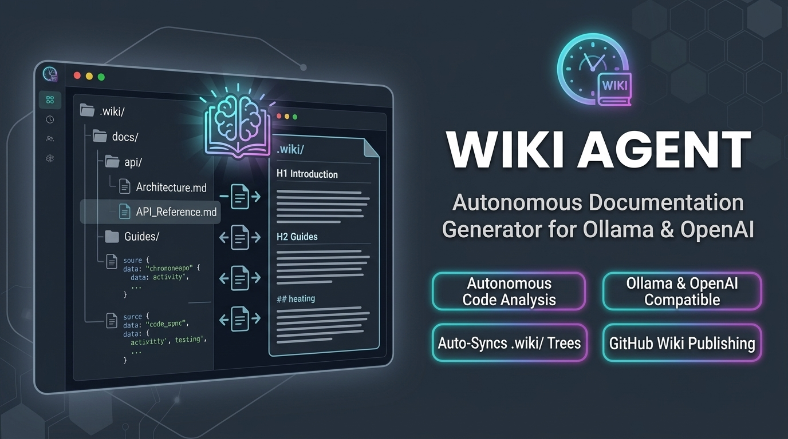

<p align="center">
  
</p>

# Wiki Agent

[](https://www.npmjs.com/package/@chronova/wiki-agent)
[](https://github.com/nx-solutions-ug/wiki-agent/actions/workflows/release.yml)
[](https://opensource.org/licenses/ISC)

A standalone documentation agent that runs against Ollama or any OpenAI-compatible provider. It inspects your source code and generates a wiki under `.wiki/` in your project root, with optional publishing to the GitHub Wiki tab.

## Features

- **Pluggable LLM provider** — uses the native `ollama` SDK for local/cloud Ollama or the official `openai` SDK for any OpenAI-compatible endpoint (OpenAI, Azure OpenAI, local servers like Ollama's OpenAI-compatible mode, vLLM, LM Studio, etc.). No LangChain dependency.
- **Local, Cloud, or OpenAI-compatible** — connect to a local Ollama server, Ollama Cloud with an API key, or any OpenAI-compatible endpoint by setting the provider mode and an API key
- **TUI + Headless** — interactive terminal UI or `--print` for CI/CD
- **Two commands** — `--init` to create docs from scratch, `--update` to refresh existing docs; `--version` to show the current version
- **Repo instructions** — reads `AGENTS.md` or `CLAUDE.md` from the project root and follows all conventions documented there. On `--init`, a `## Wiki Agent` section is appended (never prepended) to `AGENTS.md` (or `CLAUDE.md` if only that exists) declaring the project is managed by wiki-agent, with the version and initialization timestamp. If neither file exists, `AGENTS.md` is created. The section is idempotent — subsequent `--init` runs refresh the version/timestamp rather than duplicating it
- **Configurable** — global config in `~/.wiki/`, project config in `.wiki/`
- **GitHub Actions** — every run creates (or updates) `.github/workflows/update-wiki.yml` for scheduled updates
- **Change reports** — each run writes `.wiki/.last-update-report.md` with created/edited pages, used as the staging PR body in CI. Run-metadata files (`.last-update-report.md`, `.last-update-title.txt`) and embedding database files are gitignored so they never enter git history; they exist on disk for the CI step and human inspection only
- **Restricted toolset** — the agent can only read files, write under `.wiki/`, run read-only git subcommands, and use a `gh` CLI tool for inspecting pull requests and closing stale wiki staging PRs; there is no shell tool
- **Staging PR staleness check** — before writing in update mode, the agent checks for open wiki staging PRs, abandons the update if a newer one already exists, and closes stale ones with a comment ("This branch is from an earlier staging run and is stale. Closing")
- **Frontmatter stripping** — YAML frontmatter is stripped before publishing to the GitHub Wiki tab, since GitHub Wiki renders frontmatter as literal text
- **MCP server** — `wiki --mcp stdio` starts a streamable MCP server exposing wiki tools to AI assistants: read pages, list pages, semantic search, trigger updates, and rebuild the embeddings index
- **Embeddings database** — builds a SQLite vector store (`.wiki/wiki.db`) using sqlite-vec for semantic search over wiki content. Supports local embeddings via Hugging Face Transformers.js (all-MiniLM-L6-v2, on-device) or Ollama embeddings (nomic-embed-text). Configurable via the TUI or environment variables

## Quickstart

### 1. Install

Install globally from npm:

```bash
npm install -g @chronova/wiki-agent
```

Or with bun:

```bash
bun add -g @chronova/wiki-agent
```

Verify the install:

```bash
wiki --version
wiki --help
```

### 2. Configure

Run interactively once to set up credentials:

```bash
cd your-project
wiki --init
```

This launches the TUI where you select the provider (Ollama Local, Ollama Cloud, or OpenAI-compatible) and enter your API key (required for cloud and OpenAI modes). The default model is `kimi-k2.7-code`.

### 3. Use

```bash
# Initialize documentation (creates .github/workflows/update-wiki.yml)
wiki --init

# Initialize and publish to the GitHub Wiki tab
wiki --init --wiki

# Update existing documentation
wiki --update

# Update and publish to the GitHub Wiki tab
wiki --update --wiki

# Headless mode with full tool logs (verbose)
wiki --update --print --verbose

# Headless mode (for CI)
wiki --update --print

# Headless mode with wiki tab publishing
wiki --update --print --wiki

# Show version
wiki --version

# Specify a model override
wiki --init --print --model llama3.2
```

### 4. MCP Server (optional)

Run wiki-agent as a streamable MCP server for AI assistants to read and update your wiki:

```bash
# Start MCP server on stdio
wiki --mcp stdio
```

This exposes 5 tools to MCP clients (e.g. Claude Desktop, Cursor, any MCP-compatible assistant):

| Tool | Description |
|------|-------------|
| `read_wiki_page` | Read a wiki page by relative path |
| `list_wiki_pages` | List all wiki pages |
| `search_wiki` | Semantic search over wiki content using embeddings |
| `update_wiki` | Trigger a wiki-agent update run |
| `rebuild_embeddings` | Rebuild the embeddings database from wiki content |

The embeddings database (`.wiki/wiki.db`) uses SQLite + sqlite-vec for vector search. Two embedding backends are supported:

- **Local** (default): Hugging Face Transformers.js with `all-MiniLM-L6-v2` (384-dim, runs on-device, no server needed)
- **Ollama**: Uses your Ollama server with a configurable embedding model (default: `nomic-embed-text`)

Configure the embedding provider in the interactive TUI setup wizard, via environment variables, or in `~/.wiki/config.json`.

### Global config (`~/.wiki/config.json`)

For local (default — no API key required):

```json
{
  "mode": "local",
  "defaultModel": "kimi-k2.7-code",
  "embeddingProvider": "local",
  "embeddingModel": "nomic-embed-text",
  "embeddingHost": "http://localhost:11434"
}
```

For cloud:

```json
{
  "mode": "cloud",
  "apiKey": "your-api-key",
  "defaultModel": "kimi-k2.7-code",
  "embeddingProvider": "local",
  "embeddingModel": "nomic-embed-text",
  "embeddingHost": "http://localhost:11434"
}
```

For OpenAI or any OpenAI-compatible endpoint (OpenAI, Azure OpenAI, local servers like Ollama's OpenAI-compatible mode, vLLM, LM Studio, etc.). `baseUrl` defaults to `https://api.openai.com/v1` when unset:

```json
{
  "mode": "openai",
  "apiKey": "your-openai-api-key",
  "baseUrl": "https://api.openai.com/v1",
  "defaultModel": "gpt-4o",
  "embeddingProvider": "local",
  "embeddingModel": "nomic-embed-text",
  "embeddingHost": "http://localhost:11434"
}
```


### Project config (`.wiki/config.json`)

```json
{
  "modelOverride": "llama3.2",
  "lastUpdate": {
    "commitSha": "abc1234",
    "timestamp": "2026-07-17T00:00:00Z"
  }
}
```

### Environment variables

| Variable | Description | Default |
|----------|-------------|---------|
| `WIKI_PROVIDER_MODE` | `"local"`, `"cloud"`, or `"openai"` (provider-agnostic; takes precedence over `WIKI_OLLAMA_MODE`) | from config |
| `WIKI_PROVIDER_API_KEY` | API key for cloud or openai mode (takes precedence over `WIKI_OLLAMA_API_KEY`) | from config |
| `WIKI_PROVIDER_BASE_URL` | Override provider base URL (takes precedence over `WIKI_OLLAMA_BASE_URL`; for `openai` mode this is the OpenAI-compatible endpoint) | `http://localhost:11434` / `https://ollama.com` / `https://api.openai.com/v1` |
| `WIKI_OLLAMA_MODE` | `"local"`, `"cloud"`, or `"openai"` | from config |
| `WIKI_OLLAMA_API_KEY` | API key (required for cloud and openai modes) | from config |
| `WIKI_OLLAMA_BASE_URL` | Override Ollama server URL | `http://localhost:11434` / `https://ollama.com` |
| `WIKI_MODEL` | Override model ID | from config |
| `WIKI_RECURSION_LIMIT` | Max agent iterations | `200` |
| `WIKI_EMBEDDING_PROVIDER` | Embedding provider: `"local"` (Transformers.js, on-device) or `"ollama"` | `local` |
| `WIKI_EMBEDDING_MODEL` | Ollama embedding model (only used when provider is `ollama`) | `nomic-embed-text` |
| `WIKI_EMBEDDING_HOST` | Ollama server URL for embeddings | `http://localhost:11434` |
| `GH_TOKEN` | GitHub token for the `gh` CLI tool (read-only inspection plus staging PR close/comment; used in CI for the staging PR staleness check) | from environment |

Environment variables take priority over config files.

## GitHub Actions

Running `wiki --init` (or `wiki --update`) automatically creates `.github/workflows/update-wiki.yml` in your repo. With `--wiki`, the workflow publishes generated pages to your repository's **GitHub Wiki tab**; without `--wiki` it only stages `.wiki/` and opens a staging PR.

1. Generates a GitHub App token if `APP_CLIENT_ID` and `APP_PRIVATE_KEY` secrets are set (falls back to `GITHUB_TOKEN`)
2. Checks out your repo, sets up Bun and Node.js, and installs wiki-agent globally from npm
3. Runs `wiki --update --print --verbose --wiki` with `GH_TOKEN` set so the agent's `gh` tool can inspect open PRs, staging pages under `.wiki/`
4. Probes the wiki remote (`<repo>.wiki.git`) with `git ls-remote` to detect whether the wiki has been initialized
5. If there are content changes and the wiki is initialized: flattens the `.wiki/` tree (stripping frontmatter, converting to flat wiki filenames), clones `<repo>.wiki.git`, rsyncs the flattened output, commits, and **pushes directly to `master`** — the wiki goes live immediately (no PR, no review gate)
6. Opens a `docs: wiki staging snapshot` pull request against the main repo when there are content changes, so the staged content stays auditable

### Bootstrap the wiki first

GitHub wikis must be initialized once through the UI before they can be pushed to programmatically. Open the **Wiki** tab in your repository, create the first page (any content), then run the workflow. Until then the publish step is skipped with a warning; the staging PR still opens so you can inspect the generated content.

### Required secrets

| Secret | Required | Description |
|--------|----------|-------------|
| `WIKI_OLLAMA_API_KEY` (or `WIKI_PROVIDER_API_KEY`) | Yes | API key — required when mode is `cloud` or `openai`. `WIKI_PROVIDER_API_KEY` takes precedence when both are set. |
| `APP_CLIENT_ID` | No | GitHub App client ID for token generation (falls back to `GITHUB_TOKEN`) |
| `APP_PRIVATE_KEY` | No | GitHub App private key |
| `WIKI_PUSH_TOKEN` | No | PAT with `repo` scope used to push to the wiki repo. If unset, the GitHub App token or `GITHUB_TOKEN` is used. Set this only if the default token cannot push to the wiki repo. |

### Optional variables

| Variable | Default | Description |
|----------|---------|-------------|
| `WIKI_MODEL` | `kimi-k2.7-code` | Model ID override |

## Output

Each run produces:

```
.wiki/
├── .gitignore                # Ignores run-metadata files (see below)
├── config.json               # Project-specific config
├── quickstart.md             # Entry point
├── architecture/
│   ├── index.md              # Auto-generated directory index
│   └── overview.md
├── cli/
│   ├── index.md
│   └── usage.md
└── index.md                  # Root directory index
```

Run-metadata files are written to `.wiki/` on every run but are gitignored — they never enter git history and exist on disk for the CI step and human inspection only:

- `.last-update-report.md` — markdown report listing created and edited pages, used as the staging PR body in CI
- `.last-update-title.txt` — concise PR title for the staging snapshot PR
- `index.md` files — auto-generated for each directory, listing pages and subdirectories with frontmatter titles/descriptions

Every wiki markdown file written by the agent includes two metadata frontmatter entries:
- `last_updated` — ISO timestamp of the update (e.g. `2026-08-26T07:34:13.000Z`)
- `updated_by` — author attribution (`"wiki-agent"` for automated CI runs, `"mcp-server"` for MCP updates, or the user's Git `user.name`)

## Development

```bash
bun install
npx tsc -p tsconfig.json
npx vitest run
bun pm pack
```

## How it works

1. The agent reads `AGENTS.md` or `CLAUDE.md` from the project root and follows all conventions documented there
2. It inspects your source code using a restricted toolset: `read_file`, `ls`, `glob`, `grep`, `ast_grep`, `ast_search`, a read-only `git` tool (whitelisted subcommands only — no mutating git, no shell), and a `gh` CLI tool for inspecting pull requests and managing stale wiki staging PRs
3. In update mode, it checks for open wiki staging PRs via `gh pr list` and compares branch timestamps against the latest commit — if a newer staging PR already exists, it abandons the update; stale PRs (older branch timestamp) are closed with a comment ("This branch is from an earlier staging run and is stale. Closing")
4. It generates wiki pages under `.wiki/` with YAML frontmatter (`type`, `title`, `description`, `tags`, `last_updated`, `updated_by`) using `write_file` and `edit_file` (the only mutating tools, constrained to `.wiki/`)
5. After the run, `index.md` files are synchronized for each directory with `last_updated` and `updated_by` frontmatter
6. `.wiki/.gitignore` is written (ignoring run-metadata and embedding database files), then `.last-update-report.md` and `.last-update-title.txt` are written. These run-metadata files stay out of git history; only real wiki content changes are committed to the staging PR
7. On `--init`, a `## Wiki Agent` section is appended to `AGENTS.md` (or `CLAUDE.md` if only that exists) declaring the project uses wiki-agent; if neither file exists, `AGENTS.md` is created. The section is idempotent
8. A GitHub Actions workflow is created (or updated) for scheduled updates on every run
9. In update mode, only pages affected by recent changes are refreshed
10. With `--wiki`, the workflow flattens the `.wiki/` tree (stripping frontmatter, converting nested paths to flat dash-joined filenames, rewriting links) and publishes to the GitHub Wiki tab by pushing directly to `<repo>.wiki.git` `master`

The agent uses a manual tool-calling loop against the resolved LLM provider (Ollama chat API or the OpenAI-compatible chat completions API) — no LangChain or LangGraph dependency. The recursion limit prevents infinite loops. There is no general-purpose shell tool; the agent cannot execute arbitrary commands on the host system. The `gh` tool allows read-only inspection (pr list, pr view, repo view, etc.) plus `pr close` and `pr comment` — but only on wiki staging PRs (branches matching `wiki/staging-*`); all other mutating operations are blocked.